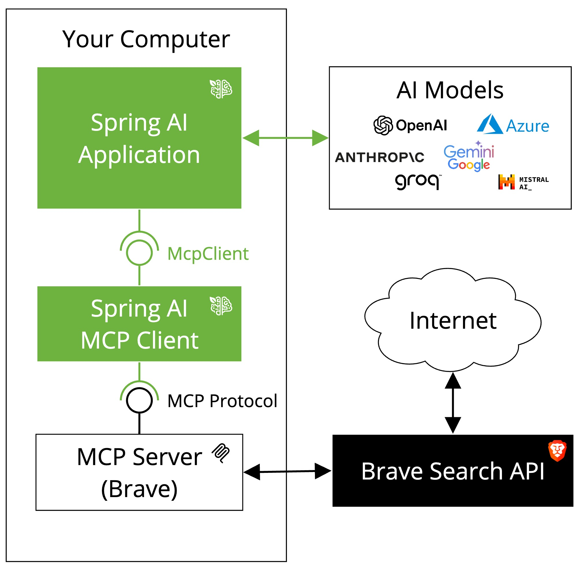

# NestJS AI MCP Brave Search Example

This sample ports the Spring AI Brave Search MCP example to NestJS AI. It starts a Brave Search MCP client from `mcp-servers-config.json`, discovers the server tools, and asks one predefined question against the model before exiting.



## Overview

The sample demonstrates:

- `@nestjs-ai/client-chat` for prompt execution
- `@nestjs-ai/mcp-client` for stdio MCP client setup from a JSON config file
- `@nestjs-ai/mcp-common` for tool discovery through `McpToolCallbackProvider`
- `@nestjs-ai/model` for `ToolCallbackProvider`
- OpenAI chat model integration through `@nestjs-ai/model-openai`
- A predefined question flow that prints the answer to the console

## How It Works

1. The app loads `mcp-servers-config.json`
2. `McpClientModule` starts the Brave Search MCP client through `npx`
3. `McpToolCallbackProvider` discovers the available Brave Search tools
4. The resulting `ToolCallbackProvider` is attached to a `ChatClient`
5. The app asks a single question and exits after printing the answer

## Configuration

Set the API key used by the chat model:

```bash
export OPENAI_API_KEY=your-openai-key
```

Optional model override:

```bash
export OPENAI_MODEL=gpt-4o
```

The Brave Search MCP server also expects a Brave API key in the environment:

```bash
export BRAVE_API_KEY=your-brave-api-key
```

## Running the Sample

```bash
pnpm install
pnpm start
```

## Additional Resources

- [NestJS AI Documentation](https://nestjs-port.github.io/nestjs-ai)
- [Model Context Protocol Specification](https://modelcontextprotocol.github.io/specification/)
