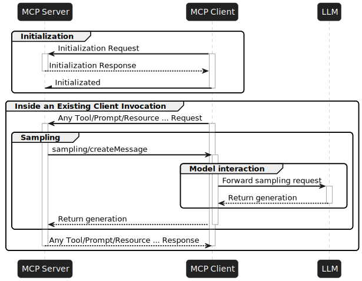

# NestJS AI MCP Sampling Examples

This directory contains the NestJS AI examples for MCP Sampling. The samples show how an MCP server can delegate a request back to a connected MCP client, which then routes the request to the appropriate chat model based on the model hint.

## Overview

The examples cover:

- An MCP server that fetches weather data from Open-Meteo
- MCP Sampling on the server side through `McpServerExchange`
- A client that receives sampling requests and routes them to OpenAI or Anthropic
- Both standard and annotation-based NestJS AI implementations
- Combining weather data with creative responses from multiple LLMs

## Projects

### Standard NestJS AI Samples

1. [`mcp-sampling-server`](./mcp-sampling-server) - MCP server that exposes a weather tool and requests poems through sampling
2. [`mcp-sampling-client`](./mcp-sampling-client) - MCP client that handles sampling requests and routes them to chat models

### Annotation-Based NestJS AI Samples

1. [`annotations/mcp-sampling-server-annotations`](./annotations/mcp-sampling-server-annotations) - Decorator-based server implementation
2. [`annotations/mcp-sampling-client-annotations`](./annotations/mcp-sampling-client-annotations) - Decorator-based client implementation

## How It Works

1. The client connects to the MCP server over Streamable HTTP at `http://localhost:3000/mcp`
2. The client registers a sampling handler for `sampling/createMessage`
3. The server fetches current weather data and checks whether the client supports sampling
4. The server sends two sampling requests with model hints for OpenAI and Anthropic
5. The client extracts the prompt and hint, then forwards the request to the matching chat model
6. The server combines the returned poems with the weather response



## Running The Examples

### Standard Sample

1. Start the server:

   ```bash
   cd ./mcp-sampling-server
   pnpm start
   ```

2. Set the required API keys:

   ```bash
   export OPENAI_API_KEY=your-openai-key
   export ANTHROPIC_API_KEY=your-anthropic-key
   ```

3. Run the client:

   ```bash
   cd ./mcp-sampling-client
   pnpm start
   ```

The client prints the combined weather and poem response after the sampling exchange completes.

### Annotation-Based Sample

1. Start the server:

   ```bash
   cd ./annotations/mcp-sampling-server-annotations
   pnpm start
   ```

2. Set the required API keys:

   ```bash
   export OPENAI_API_KEY=your-openai-key
   export ANTHROPIC_API_KEY=your-anthropic-key
   ```

3. Run the client:

   ```bash
   cd ./annotations/mcp-sampling-client-annotations
   pnpm start
   ```

## Integration Test

The standard sample includes an end-to-end test runner that starts the server and client flow:

```bash
cd ./integration-tests
pnpm run integration:e2e
```

## Additional Resources

- [NestJS AI MCP Sampling Server](./mcp-sampling-server/README.md)
- [NestJS AI MCP Sampling Client](./mcp-sampling-client/README.md)
- [NestJS AI MCP Sampling Server Annotations](./annotations/mcp-sampling-server-annotations/README.md)
- [NestJS AI MCP Sampling Client Annotations](./annotations/mcp-sampling-client-annotations/README.md)
- [NestJS AI Documentation](https://nestjs-port.github.io/nestjs-ai)
- [Model Context Protocol Specification](https://modelcontextprotocol.github.io/specification/)
